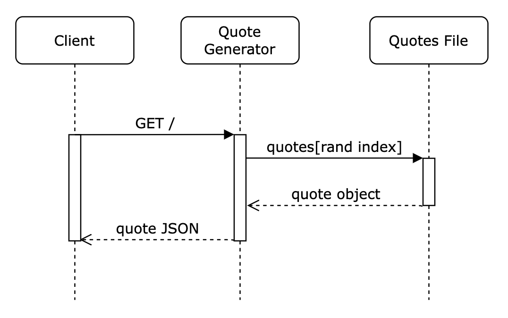

# README

Quote Generator is a simple RESTful Node API with a single GET route. When the user hits the API with a standard GET request, the application will return a random quote, along with the quote's author in the form of a JSON object.

The quotes are contained in a large array in a separate file. Each array contains an object, with key/value pairs: "quote" and "author." The application first creates a random number based on the length of the quotes array. Then it will pull the corresponding quote object from the array and return it in JSON form.

At this time, there are 50 quotes. This large number helps decrease the possibility of the end user seeing the same quote twice in a row.

## Request

This app is currently deployed to Render.com as a publically available API with no authentication.

[https://quote-generator-api-7gw0.onrender.com/](https://quote-generator-api-7gw0.onrender.com/)

This is a simple GET request with no body (payload). And while headers should not be needed, it's good practice to explicitly set the Content-Type.

### Example call with Promises

```
const apiUrl = 'https://quote-generator-api-7gw0.onrender.com/'

async function fetchQuote(url) {
  const config = {
    method: 'GET',
    headers: { 'Content-Type': 'application/json' },
  }
  const res = await fetch(url, config)
  const quote = await res.json()
  return quote
}

fetchQuote(apiUrl).then(res => console.log(res))
```

## Response

Successful responses are standard JSON containing one object with two properties: "quote" and "author."

### Example JSON response

```
{
  "quote": "Today I will do what others won’t, so tomorrow I can accomplish what others can’t.",
  "author": "Jerry Rice"
}
```

## UML Sequence Diagram


